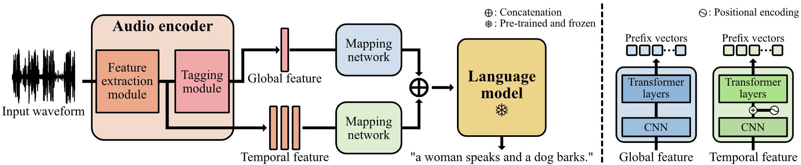

# About the source code

This repository contains a pytorch implementation for the ICASSP 2023 paper, "Prefix tuning for automated audio captioning" 
<br>
[[project page](https://PrefixAAC.github.io)] [[paper](https://ieeexplore.ieee.org/document/10096877)] <br>




<br>

## Model preparation

### Downloading the audio encoder pre-trained on AudioSet

1. Move to **AAC_Prefix/PANNs**
2. Type in the command below
   
```
gdown https://drive.google.com/file/d/1O-rPXe_anLArvRG4Z3-nLdBYNO_JaFYL/view?usp=sharing --fuzzy
```

### Downloading the pre-trained GPT2 from Huggingface

1. Move to **ClipCap_forAAC**
2. Type in the command below

```
gdown https://drive.google.com/file/d/15ASmIoWg0ac6qm0ixdiVwh88e8EA2MZ7/view?usp=share_link --fuzzy

```
3. Unzip the zip file

### Downloading the pre-trained model for this work 

1. Move to **ClipCap_forAAC**
2. Type in the command below
```
gdown https://drive.google.com/file/d/1y2yeK7eO5DFY8n9l9QfiVRwv6GZLEnFA/view?usp=share_link --fuzzy
```

3. Unzip the zip file

<br>

## Dataset download

### download the Clotho dataset

1. Move to **Clotho/clotho_audio_files**
2. Type in the command below
```
gdown https://drive.google.com/file/d/1kOuZrOs1yuOwlOky7ZohVVeiVwYQg1V0/view?usp=sharing --fuzzy
```
3. Unzip the zip file

<br>

### download the AudioCaps Dataset

1. Move to **AudioCaps**
2. Type in the command below

```
gdown https://drive.google.com/file/d/15ODyZmXDu_gwl-GcgQ6i_dBIeLKPG5-S/view?usp=sharing --fuzzy
```
3. Unzip the zip file

<br>
<br>

## Download the audio caption evaluation tools

1. Move to **coco_caption**
2. Type in the command below
```
sh get_stanford_models.sh 
```

<br>

# Train the model
 
```
# If you are using GPT2 Tokenizer
python3 Experiment_AudioCaps.py <Experiment_name> # AudioCaps Dataset
python3 Experiment_Clotho.py <Experiment_name> # Clotho Dataset
python3 Experiment_FusionDataset.py <Experiment_name> # AudioCaps&Clotho Dataset

# If you are using custom Tokenizer
python3 Experiment_AudioCaps.py <Experiment_name> <vocab_size> # AudioCaps Dataset
python3 Experiment_Clotho.py <Experiment_name> <vocab_size> # Clotho Dataset
python3 Experiment_FusionDataset.py <Experiment_name> # AudioCaps&Clotho Dataset
```

<br>

# Evaluate the model


```
# If you use gpt2 that was pre-trained by Huggingface
python3 Evaluation_AudioCaps.py <model_name> <epoch_number>
python3 Evaluation_Clotho.py <model_name> <epoch_number>

# If you use a custom tokenizer that was trained by us
python3 Evaluation_AudioCaps.py <model_name> <epoch_number> <vocab_size>
python3 Evaluation_Clotho.py <model_name> <epoch_number> <vocab_size>
```

<br>

# Inference

```
python3 Inference.py <Dataset_name> <vocab_type> <audio_path>
# Example
python3 Inference.py AudioSet GPT2 ./test.wav

```


# Citation

```
@inproceedings{kim2023prefix,
        title={Prefix tuning for automated audio captioning},
        author={Kim, Minkyu and Sung-Bin, Kim and Oh, Tae-Hyun},
        booktitle={ICASSP 2023-2023 IEEE International Conference on Acoustics, Speech and Signal Processing (ICASSP)},
        pages={1--5},
        year={2023},
        organization={IEEE}
      }
```
